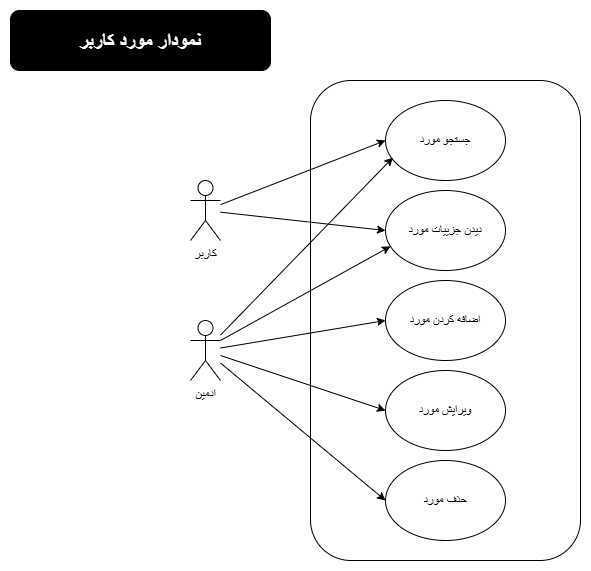
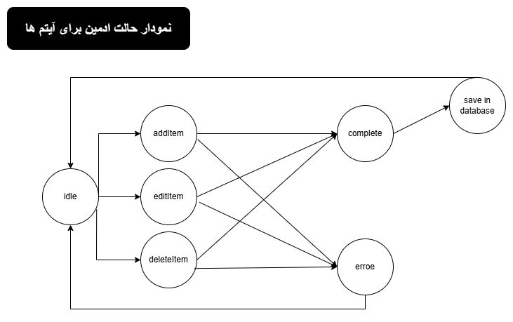
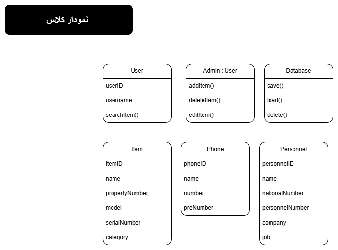
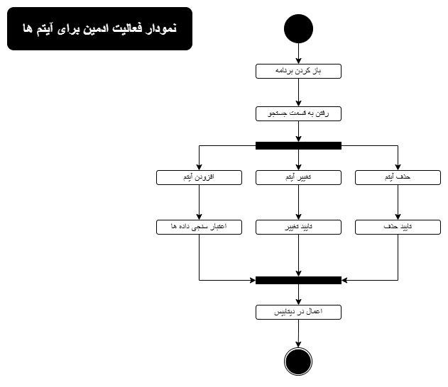
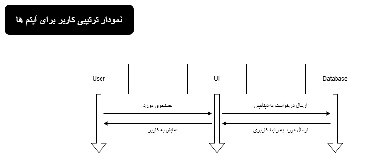

---

## معماری پروژه

```text
Warehouse/
│   .gitattributes
│   .gitignore
│   app.py
│   app_develope.py
│   config.py
│   Database_Backup_Script.bat
│   extensions.py
│   InTHeNameOfAllah.txt
│   LICENSE
│   models.py
│   README.md
│   user_maker.py
│   __init__.py
│
├───data
│   │   items.xlsx
│   │   personnels.xlsx
│   │   Phones.xlsx
│   │   RepairItems.xlsx
│   │
│   └───Archive
│           items.xlsx
│           personnels.xlsx
│           Phones.xlsx
│           PhonesData.xlsx
│           RepairItems.xlsx
│
├───documents
│   │   My IT Docs.pptx
│   │
│   └───MyIT
│       │   mkdocs.yml
│       │
│       └───docs
│               backlog.md
│               git.md
│               install.md
│               intro.md
│               members_and_architects.md
│               project_graph.md
│               project_test.md
│               style.css
│               tasks.md
│
├───logs
│       activity.log
│
├───reqired
│   │   Libraries.txt
│   │   nssm-2.24.zip
│   
├───routes
│   │   camera.py
│   │   dashboard.py
│   │   documet.py
│   │   history.py
│   │   item.py
│   │   login.py
│   │   personnel.py
│   │   phone.py
│   │   report.py
│   │   router.py
│   │   settings.py
│   │   switch.py
│   │   __init__.py
│   
│
├───static
│   ├───css
│   │       bootstrap-grid.css
│   │       bootstrap-grid.css.map
│   │       bootstrap-grid.min.css
│   │       bootstrap-grid.min.css.map
│   │       bootstrap-grid.rtl.css
│   │       bootstrap-grid.rtl.css.map
│   │       bootstrap-grid.rtl.min.css
│   │       bootstrap-grid.rtl.min.css.map
│   │       bootstrap-reboot.css
│   │       bootstrap-reboot.css.map
│   │       bootstrap-reboot.min.css
│   │       bootstrap-reboot.min.css.map
│   │       bootstrap-reboot.rtl.css
│   │       bootstrap-reboot.rtl.css.map
│   │       bootstrap-reboot.rtl.min.css
│   │       bootstrap-reboot.rtl.min.css.map
│   │       bootstrap-utilities.css
│   │       bootstrap-utilities.css.map
│   │       bootstrap-utilities.min.css
│   │       bootstrap-utilities.min.css.map
│   │       bootstrap-utilities.rtl.css
│   │       bootstrap-utilities.rtl.css.map
│   │       bootstrap-utilities.rtl.min.css
│   │       bootstrap-utilities.rtl.min.css.map
│   │       bootstrap.css
│   │       bootstrap.css.map
│   │       bootstrap.min.css
│   │       bootstrap.min.css.map
│   │       bootstrap.rtl.css
│   │       bootstrap.rtl.css.map
│   │       bootstrap.rtl.min.css
│   │       bootstrap.rtl.min.css.map
│   │       fonts.css
│   │       rtl.css
│   │
│   ├───fonts
│   │       Digi Hamishe Bold.ttf
│   │       Digi Trafic Bold.ttf
│   │       DigiHamisheRegular.ttf
│   │
│   ├───icons
│   │       apple-touch-icon.png
│   │       favicon-96x96.png
│   │       favicon.ico
│   │       favicon.svg
│   │       web-app-manifest-192x192.png
│   │       web-app-manifest-512x512.png
│   │
│   └───js
│       │   app.webmanifest
│       │   bootstrap.bundle.js
│       │   bootstrap.bundle.js.map
│       │   bootstrap.bundle.min.js
│       │   bootstrap.bundle.min.js.map
│       │   bootstrap.esm.js
│       │   bootstrap.esm.js.map
│       │   bootstrap.esm.min.js
│       │   bootstrap.esm.min.js.map
│       │   bootstrap.js
│       │   bootstrap.js.map
│       │   bootstrap.min.js
│       │   bootstrap.min.js.map
│       │   service-worker.js
│                         
│
├───templates
│   │   base.html
│   │   login.html
│   │
│   ├───camera_panel
│   │       camera.html
│   │
│   ├───dashboard_panel
│   │       dashboard.html
│   │
│   ├───document_panel
│   │       document.html
│   │
│   ├───item_panel
│   │   │   add_item.html
│   │   │   add_multy_item.html
│   │   │   edit_item.html
│   │   │   history_detail.html
│   │   │   item.html
│   │   │   item_detail.html
│   │   │   show_all_records.html
│   │   │   show_exel_records.html
│   │   │   show_latest_changes.html
│   │   │
│   │   ├───history
│   │   │       history.html
│   │   │
│   │   └───repair
│   │           add_multy_repair_item.html
│   │           add_repair_item.html
│   │           edit_repair_item.html
│   │           repair_item.html
│   │           show_exel_records_repair.html
│   │
│   ├───personnel_panel
│   │       add_multy_personnel.html
│   │       add_personnel.html
│   │       edit_personnel.html
│   │       personnel.html
│   │       show_exel_records.html
│   │
│   ├───phone_panel
│   │       add_multy_phone.html
│   │       add_phone.html
│   │       edit_phone.html
│   │       phone.html
│   │       show_exel_records.html
│   │
│   ├───report_panel
│   │       report.html
│   │
│   ├───router_panel
│   │       router.html
│   │
│   ├───settings_panel
│   │       settings.html
│   │
│   └───switch_panel
│           switch.html
│
├───uploads
│       ItemsSample.xlsx
│       PersonnelsSample.xlsx
│       PhonesSample.xlsx
│       RepairItemsSample.xlsx

```

---

## نمودار Usecase




---

## نمودار State



---

## نودار Class



---

## نمودار Activity



---

## نودار Sequence



---